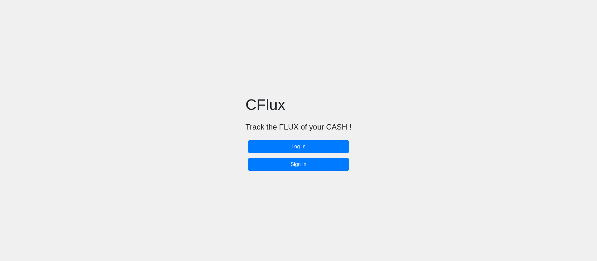
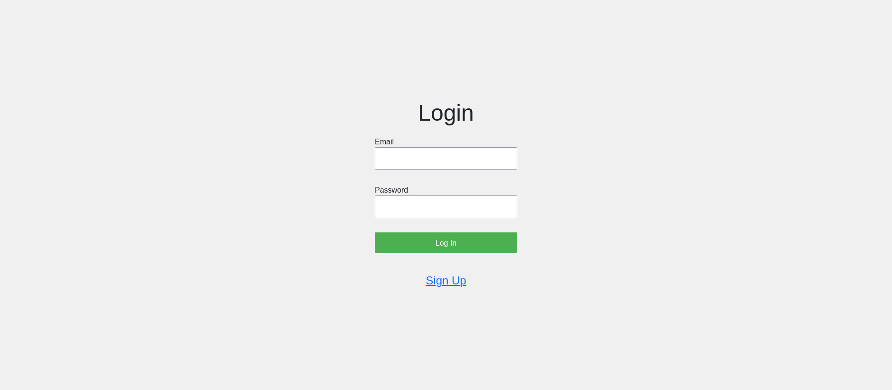
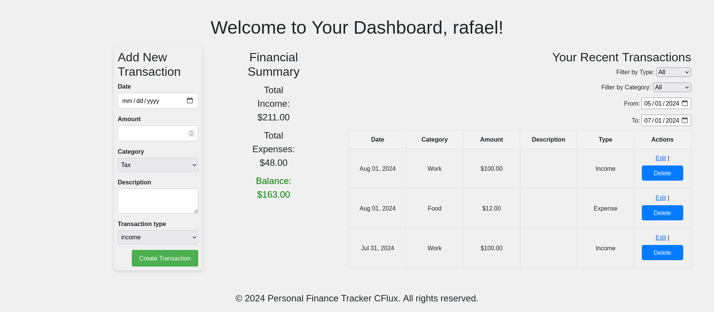

# CFLux - A personal finance tracker project made with Rails and Ruby 






### Requirements : Have Ruby and Rails (preferably Rails 7 or > 7) installed locally
<hr>

### Recommendation to build/install the rails dependencies at onces (from the root of the project) : 
#### Note : this might take 5 minutes or more

```
bash cflux/bundle-installation
```

### So after that you can start the database (in the rails project cflux/): 

```
rails db:create
rails db:migrate
rails db:migrate:status
```

### And, finally, run the app (in the rails project cflux/): 

```
rails server
```